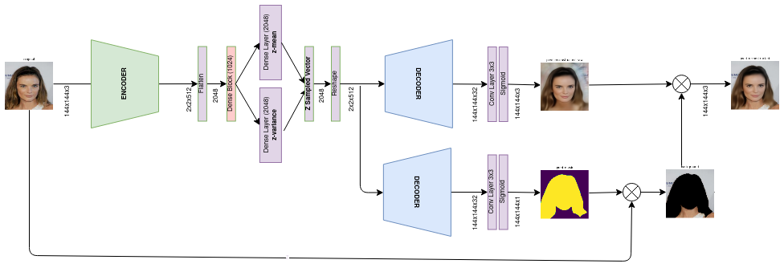

# Manipulate Facial Attributes Using VAE

[](https://colab.research.google.com/drive/1auI8GsWtazP_FHHOX0iAZ6cyC2NX3cZE?usp=sharing)

This repo presents the final project for [Computer Vision course](https://www.inf.ufsc.br/~aldo.vw/visao/) in INE / UFSC.  

The reports are written in Portuguese and saved in [reports](./reports).  

The trained model is available [here](traindir/trained_113steps/checkpoints/weights.111-1.25-1.30-1.13-0.08-0.10-0.00.h5).  

For environment compatibility, check the `environment.yml` out.  
  

## The Architecture Solution

The proposed architecture follows a common VAE architecture besides an additional decoder branch that predicts face masks. During training it uses the face mask labels too, which is used to replace the background of the reconstructed image such that the loss function is applied only on the face pixels. On the other hand, on the prediction mode the background replacement is made by the predicted mask itself, not requiring any extra input but an image.

### On training


### On prediction



## Playing on Colab

Test the project on Colab!! Generate spectrums or add specific attributes on your own, give a trial here. [](https://colab.research.google.com/drive/1auI8GsWtazP_FHHOX0iAZ6cyC2NX3cZE?usp=sharing)

## Dataset 

This project used the [CelebA](http://mmlab.ie.cuhk.edu.hk/projects/CelebA.html) dataset.  

Besides, as said in [Architecture](#architecture), the architecture solution uses the face masks during training. Although they will be not needed during prediction. To extract the masks, I used the projec [face-parsing.PyTorch](https://github.com/zllrunning/face-parsing.PyTorch). The masks are available for download [here](https://drive.google.com/file/d/1BJsxPWnBWxYWHRqMrhjBj3f324SHhBQp/view?usp=sharing).  

## Training

To train new models, set the CelebA dataset directory to the environment variable `celeba`. Make sure the directory contains the dataset images and masks are under the folder `imgs` and `mask_faceparsing` respectively.  
```
python training.py
```

The new training artifacts (logs and checkpoints) are stored in the `traindir` folder inside a subfolder names with the timestamp of the training starting moment.  

After training, the trained saved model need to be *converted* to load correctly on the testing NN architecture. To guarantee it, run:  
``` 
python convert_model_toprediction.py traindir/trained_113steps/checkpoints/weights.best.h5
```
It will save a new object on the same directory, adding the suffix `*.predict.*` on the filename.  

## Testing

During testing, you don't need the ground truth of the face mask, the NN will generate a reconstructed version of the image and a mask in the `cache` dir.  
```
python testing.py cache/samples/077771.jpg
```

## Adding Attribute

The available attributs are: Bald, Bangs, Black_Hair, Blond_Hair, Eyeglasses, Gray_Hair, Heavy_Makeup, Mustache, Pale_Skin, Pointy_Nose, Smiling, Wearing_Hat, Young.  

The command bellow generates a spectrum of that attribute, it saves a file `spectrum.jpg` in the `cache` directory.  

```
python add_attributes.py -f cache/samples/077771.jpg -a Smiling
```

The attributes are represented by vectors stored in `cache/vector_attrs/`.  

## Create new Vector Attributes  

To generate more vector attributes available on the celebA, run:  
```
python create_attributevectors.py Bags_Under_Eyes 
```

It will create a `cache/Bags_Under_Eyes.npy` file. Put it in the `cache/vector_attrs/` subfolder to make it available for the `add_attribute.py` script.  
